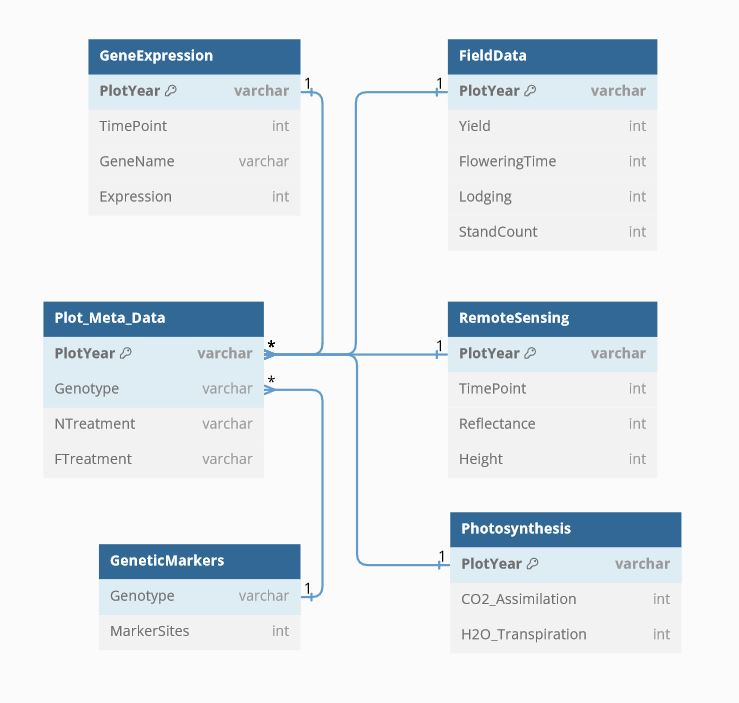

# Plant Breeding Database

As part of the Cloud Computing Fellowship at Michigan State University:  
 - Create a PostgreSQL database on the Azure cloud service using Python to interact with the server
 - Populate it with various data sources (phenotype, genotype, transcriptomics)
 - Retrieve data for analysis

## Entity-Relationship Diagram

